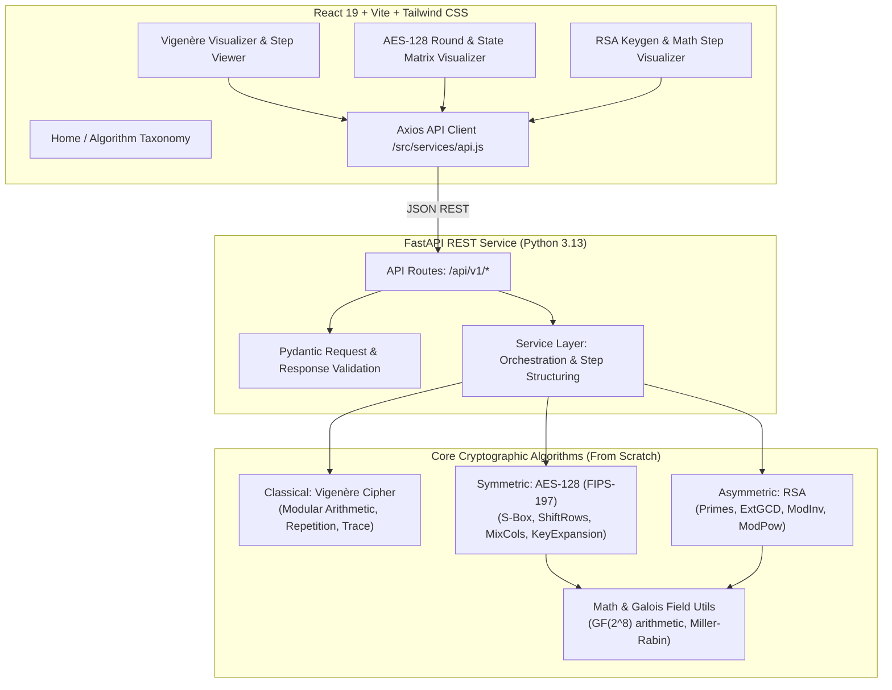

# Cryptography Algorithm Visualizer & Demonstrator — Implementation Plan

## 1. Project Overview & Objectives
The **Cryptography Algorithm Visualizer & Demonstrator** is an academic full-stack application developed for a **Cryptography and Network Security (CNS)** assignment. It provides an interactive, visual, and mathematically rigorous demonstration of three foundational cryptographic paradigms:
1. **Classical Cryptography**: Vigenère Cipher (Polyalphabetic substitution cipher)
2. **Symmetric Cryptography**: AES-128 (Advanced Encryption Standard with 128-bit blocks, 128-bit keys, 10 rounds)
3. **Asymmetric Cryptography**: RSA (Rivest–Shamir–Adleman public-key cryptosystem)

### Strict Development Rules:
- **Zero Black-Box Cryptographic Libraries**: No usage of `cryptography`, `pycryptodome`, or OpenSSL wrappers for cipher logic. All cipher transformations and mathematical algorithms (modular arithmetic, S-box substitution, matrix multiplication in $GF(2^8)$, key expansion, primality test, Extended Euclidean Algorithm, modular exponentiation) are implemented completely from scratch.
- **Strict Separation of Concerns**: Algorithm layers are standalone pure-Python modules decoupled from web frameworks. FastAPI routes communicate through a clean service layer with strict Pydantic validation schemas.
- **Mandatory AES Validation Gate**: AES-128 implementation must pass the official NIST FIPS-197 Known-Answer Test (KAT) vector:
  - Key: `000102030405060708090a0b0c0d0e0f`
  - Plaintext: `00112233445566778899aabbccddeeff`
  - Expected Ciphertext: `69c4e0d86a7b0430d8cdb78070b4c55a`
- **Granular Visualization Traces**: Backend returns structured intermediate states (step-by-step character calculations for Vigenère, round-and-operation 4×4 state matrices for AES, mathematical factors and modular exponentiation steps for RSA).

---

## 2. Architecture & Data Flow



---

## 3. Technology Stack & Directory Structure

- **Frontend**: React 18/19, Vite, Tailwind CSS, Lucide React icons, Axios, React Router v6.
- **Backend**: Python 3.13, FastAPI, Pydantic v2, Uvicorn.
- **Testing**: Pytest, HTTPX (for FastAPI TestClient).

### Repository Directory Tree:
```text
CNS-Cryptography-Lab/
├── frontend/
│   ├── src/
│   │   ├── components/
│   │   │   ├── Navbar.jsx              # Navigation header with tabs & disclaimer
│   │   │   ├── AlgorithmCard.jsx       # Taxonomy cards for Home page
│   │   │   ├── InputPanel.jsx          # Reusable inputs with validation & counters
│   │   │   ├── OutputPanel.jsx         # Result display with copy-to-clipboard
│   │   │   ├── StepViewer.jsx          # Step-by-step table & calculation renderer
│   │   │   └── StateMatrix.jsx         # 4x4 AES hex matrix interactive visualizer
│   │   ├── pages/
│   │   │   ├── Home.jsx                # Introduction & taxonomy breakdown
│   │   │   ├── Vigenere.jsx            # Vigenère encrypt/decrypt & step-by-step trace
│   │   │   ├── AES.jsx                 # AES 128-bit hex visualizer & round stepper
│   │   │   └── RSA.jsx                 # RSA interactive keygen, encrypt & decrypt
│   │   ├── services/
│   │   │   └── api.js                  # Axios instance and API call wrappers
│   │   ├── utils/
│   │   │   └── formatters.js           # Hex formatting, matrix utilities
│   │   ├── App.jsx                     # Route definitions & global layout
│   │   ├── main.jsx                    # React entrypoint
│   │   └── index.css                   # Tailwind CSS directives & custom styling
│   ├── index.html
│   ├── package.json
│   ├── tailwind.config.js
│   ├── postcss.config.js
│   └── vite.config.js
│
├── backend/
│   ├── app/
│   │   ├── main.py                     # FastAPI app setup, CORS, router inclusion
│   │   ├── api/
│   │   │   └── routes/
│   │   │       ├── vigenere.py         # /api/v1/vigenere/* endpoints
│   │   │       ├── aes.py              # /api/v1/aes/* endpoints
│   │   │       └── rsa.py              # /api/v1/rsa/* endpoints
│   │   ├── services/
│   │   │   ├── vigenere_service.py     # Vigenère business logic & step formatting
│   │   │   ├── aes_service.py          # AES round formatting & hex packaging
│   │   │   └── rsa_service.py          # RSA keygen & step packaging
│   │   ├── algorithms/
│   │   │   ├── classical/
│   │   │   │   └── vigenere.py         # Manual Vigenère implementation
│   │   │   ├── symmetric/
│   │   │   │   └── aes.py              # Manual AES-128 FIPS-197 implementation
│   │   │   └── asymmetric/
│   │   │       └── rsa.py              # Manual RSA implementation
│   │   ├── schemas/
│   │   │   ├── vigenere.py             # Pydantic schemas for Vigenère
│   │   │   ├── aes.py                  # Pydantic schemas for AES
│   │   │   └── rsa.py                  # Pydantic schemas for RSA
│   │   └── utils/
│   │       ├── encoding.py             # Hex, byte, and string conversions
│   │       └── math_utils.py           # GCD, Extended GCD, Mod Inverse, Mod Pow, Primes
│   ├── tests/
│   │   ├── test_vigenere.py            # Vigenère unit & integration tests
│   │   ├── test_aes.py                 # AES NIST KAT vector & transformation tests
│   │   └── test_rsa.py                 # RSA math & crypto tests
│   ├── requirements.txt
│   └── README.md
│
├── IMPLEMENTATION_PLAN.md
├── TASKS.md
├── README.md
└── .gitignore
```

---

## 4. Detailed Algorithm Specifications

### 4.1. Vigenère Cipher (Classical Cryptography)
- **Mathematical Formulations**:
  $$\text{Alphabet mapping: } A \mapsto 0, B \mapsto 1, \dots, Z \mapsto 25$$
  $$\text{Encryption: } C_i = (P_i + K_{i \bmod L}) \bmod 26$$
  $$\text{Decryption: } P_i = (C_i - K_{i \bmod L} + 26) \bmod 26$$
  where $L$ is the length of the normalized key.
- **Key Validation**: Alphabetical only (`[A-Za-z]`), non-empty. Spaces/numbers in key produce clear 400 Bad Request error.
- **Trace Output**:
  ```json
  {
    "position": 0,
    "plaintext_char": "H",
    "plaintext_value": 7,
    "key_char": "K",
    "key_value": 10,
    "ciphertext_value": 17,
    "ciphertext_char": "R",
    "calculation": "(7 + 10) mod 26 = 17 (R)"
  }
  ```

---

### 4.2. AES-128 (Symmetric Cryptography — FIPS-197)
- **Specifications**:
  - Block size: 128 bits (16 bytes, represented as $4 \times 4$ byte matrix in column-major order: $s_{r,c} = \text{block}[r + 4c]$).
  - Key size: 128 bits (16 bytes, 4 words of 32 bits).
  - Number of rounds: $N_r = 10$.
- **Transformations**:
  1. **Key Expansion**:
     - Words $w_0, \dots, w_3$ from original key.
     - For $i = 4 \dots 43$:
       - If $i \bmod 4 == 0$: $w_i = w_{i-4} \oplus \text{SubWord}(\text{RotWord}(w_{i-1})) \oplus \text{Rcon}[i / 4]$.
       - Else: $w_i = w_{i-4} \oplus w_{i-1}$.
     - Yields 11 round keys (Round 0 to Round 10).
  2. **SubBytes / InvSubBytes**:
     - Byte-by-byte non-linear substitution using the 256-element S-box (constructed from multiplicative inverse in $GF(2^8)$ and affine transformation).
  3. **ShiftRows / InvShiftRows**:
     - Row 0: no shift.
     - Row 1: circular left shift by 1 (right shift for Inv).
     - Row 2: circular left shift by 2.
     - Row 3: circular left shift by 3.
  4. **MixColumns / InvMixColumns**:
     - Matrix multiplication in $GF(2^8)$ modulo irreducible polynomial $m(x) = x^8 + x^4 + x^3 + x + 1$ ($0\text{x}11\text{B}$):
       $$\begin{bmatrix} s'_{0,c} \\ s'_{1,c} \\ s'_{2,c} \\ s'_{3,c} \end{bmatrix} = \begin{bmatrix} 02 & 03 & 01 & 01 \\ 01 & 02 & 03 & 01 \\ 01 & 01 & 02 & 03 \\ 03 & 01 & 01 & 02 \end{bmatrix} \begin{bmatrix} s_{0,c} \\ s_{1,c} \\ s_{2,c} \\ s_{3,c} \end{bmatrix}$$
     - Implemented with Galois Field multiplication helper `gmul(a, b)`.
  5. **AddRoundKey**:
     - Bitwise XOR between the 16-byte state matrix and the 16-byte round key.
- **Round Sequence**:
  - **Encryption**:
    - Round 0: `AddRoundKey(w[0..3])`
    - Rounds 1..9: `SubBytes` $\to$ `ShiftRows` $\to$ `MixColumns` $\to$ `AddRoundKey(w[4r..4r+3])`
    - Round 10: `SubBytes` $\to$ `ShiftRows` $\to$ `AddRoundKey(w[40..43])`
  - **Decryption (Standard Equivalent / Inverse Flow)**:
    - Round 10: `AddRoundKey(w[40..43])`
    - Rounds 9..1: `InvShiftRows` $\to$ `InvSubBytes` $\to$ `AddRoundKey(w[4r..4r+3])` $\to$ `InvMixColumns`
    - Round 0: `InvShiftRows` $\to$ `InvSubBytes` $\to$ `AddRoundKey(w[0..3])`
- **Known-Answer Test Verification**:
  - Key: `000102030405060708090a0b0c0d0e0f`
  - Plaintext: `00112233445566778899aabbccddeeff`
  - Output: `69c4e0d86a7b0430d8cdb78070b4c55a`

---

### 4.3. RSA (Asymmetric Cryptography)
- **Mathematical Formulations**:
  1. Select two distinct prime numbers $p, q$.
  2. Modulus $n = p \times q$.
  3. Euler's Totient function: $\phi(n) = (p - 1)(q - 1)$.
  4. Public exponent $e$ such that $1 < e < \phi(n)$ and $\gcd(e, \phi(n)) = 1$.
  5. Private exponent $d$ via Extended Euclidean Algorithm:
     $$e \cdot d \equiv 1 \pmod{\phi(n)} \iff d \equiv e^{-1} \pmod{\phi(n)}$$
  6. **Encryption**: For message block $M < n$, $C = M^e \pmod n$.
  7. **Decryption**: For ciphertext block $C < n$, $M = C^d \pmod n$.
- **Modular Exponentiation**:
  - Implemented via the Square-and-Multiply (Binary Exponentiation) algorithm to avoid huge integer blowup and explicitly log each intermediate binary step for visualization.
- **Key Generation & Message Modes**:
  - Supports numeric inputs directly ($M$) as well as text mode (converting characters to ASCII integers with $M < n$ verification).
  - Clear validation checks preventing $p = q$, composite $p$ or $q$, $e$ not coprime with $\phi(n)$, and $M \ge n$.

---

## 5. API Endpoints Contract

### Common & Health:
- `GET /api/v1/health`
  - Response: `{"status": "ok", "app": "Cryptography Algorithm Visualizer & Demonstrator", "version": "1.0.0"}`

### Vigenère:
- `POST /api/v1/vigenere/encrypt`
  - Request: `{"plaintext": "HELLO CNS LAB", "key": "CIPHER"}`
  - Response: `{"ciphertext": "...", "normalized_key": "...", "steps": [...]}`
- `POST /api/v1/vigenere/decrypt`
  - Request: `{"ciphertext": "...", "key": "CIPHER"}`
  - Response: `{"plaintext": "...", "normalized_key": "...", "steps": [...]}`

### AES-128:
- `POST /api/v1/aes/encrypt`
  - Request: `{"plaintext_hex": "00112233445566778899aabbccddeeff", "key_hex": "000102030405060708090a0b0c0d0e0f"}`
  - Response:
    ```json
    {
      "ciphertext_hex": "69c4e0d86a7b0430d8cdb78070b4c55a",
      "key_schedule": ["0001020304050607...", "..."],
      "initial_state": [["00", "44", "88", "cc"], ["11", "55", "99", "dd"], ...],
      "rounds": [
        {
          "round": 1,
          "operations": [
            {"name": "SubBytes", "state": [["63", ...], ...], "description": "..."},
            {"name": "ShiftRows", "state": [...], "description": "..."},
            {"name": "MixColumns", "state": [...], "description": "..."},
            {"name": "AddRoundKey", "round_key": "...", "state": [...], "description": "..."}
          ]
        }
      ]
    }
    ```
- `POST /api/v1/aes/decrypt`
  - Request: `{"ciphertext_hex": "69c4e0d86a7b0430d8cdb78070b4c55a", "key_hex": "000102030405060708090a0b0c0d0e0f"}`
  - Response: `{"plaintext_hex": "00112233445566778899aabbccddeeff", "rounds": [...]}`

### RSA:
- `POST /api/v1/rsa/generate-keys`
  - Request: `{"p": 61, "q": 53, "e": 17}` (e is optional, auto-selected if omitted)
  - Response:
    ```json
    {
      "p": 61,
      "q": 53,
      "n": 3233,
      "phi_n": 3120,
      "e": 17,
      "d": 2753,
      "public_key": {"e": 17, "n": 3233},
      "private_key": {"d": 2753, "n": 3233},
      "derivation_steps": [
        "1. Modulus n = p * q = 61 * 53 = 3233",
        "2. Euler's Totient phi(n) = (61 - 1) * (53 - 1) = 3120",
        "3. Public exponent e = 17 (gcd(17, 3120) = 1)",
        "4. Private exponent d = 17^(-1) mod 3120 = 2753 via Extended Euclidean Algorithm"
      ]
    }
    ```
- `POST /api/v1/rsa/encrypt`
  - Request: `{"message": "65", "message_type": "number", "e": 17, "n": 3233}`
  - Response: `{"ciphertext": "2790", "blocks": [...], "math_steps": [...]}`
- `POST /api/v1/rsa/decrypt`
  - Request: `{"ciphertext": "2790", "message_type": "number", "d": 2753, "n": 3233}`
  - Response: `{"decrypted_message": "65", "blocks": [...], "math_steps": [...]}`

---

## 6. Execution Phases & Verification Plan

1. **Phase 1: Setup & Scaffolding**
   - Backend environment, requirements, FastAPI app, CORS, directory structure.
   - Frontend Vite + React + Tailwind + React Router + Axios setup.
   - Run both servers to confirm communication.
2. **Phase 2: Vigenère Implementation**
   - Pure algorithm, step tracing, schema, service, route.
   - Pytest unit tests.
   - React UI with StepViewer and formula cards.
3. **Phase 3: RSA Implementation**
   - Math utilities (GCD, ExtGCD, mod inverse, mod pow, Miller-Rabin).
   - RSA algorithm, key generation, encryption, decryption, step tracing.
   - Pytest unit tests.
   - React UI with interactive keygen, public/private key display, and modular math viewer.
4. **Phase 4: AES-128 Implementation**
   - Pure FIPS-197 AES, S-box, Key Expansion, transformations, round tracing.
   - NIST Known-Answer Test (KAT) validation.
   - Pytest tests.
   - React UI with StateMatrix (4×4 grid), round stepper, and preset NIST test vector.
5. **Phase 5: UI Integration & Polish**
   - Home page taxonomy cards, navigation bar, academic disclaimer, styling refinement.
6. **Phase 6: Full Verification & README**
   - Run complete test suite (`pytest`).
   - Write comprehensive `README.md` with theory, formulas, diagrams, setup instructions, and disclaimer.
