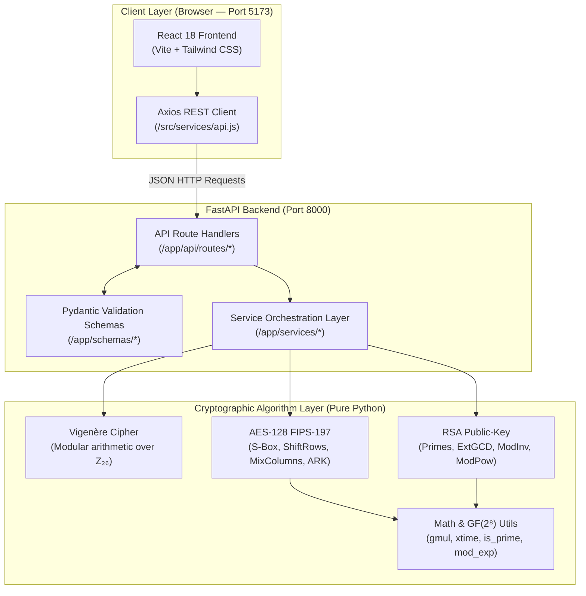

# Cryptography Algorithm Visualizer & Demonstrator

> **Academic Project — Cryptography and Network Security (CNS)**

An interactive full-stack platform that visualizes the internal operations, intermediate state transitions, and underlying mathematical foundations of three foundational cryptographic paradigms:

| Algorithm | Category | Standard |
|---|---|---|
| **Vigenère Cipher** | Classical — Polyalphabetic substitution | Historical |
| **AES-128** | Symmetric — Block cipher | NIST FIPS-197 |
| **RSA** | Asymmetric — Public-key cryptosystem | PKCS#1 / RFC 8017 |

> [!IMPORTANT]
> **Zero-library cryptographic implementations.** Every transformation — S-box substitution, Galois Field $\text{GF}(2^8)$ multiplication, Key Expansion, Extended Euclidean Algorithm, and modular exponentiation — is implemented **from scratch in pure Python**. No `cryptography`, `pycryptodome`, or OpenSSL wrappers are used for encryption or decryption.

---

## Table of Contents

1. [Project Objectives](#1-project-objectives)
2. [Technology Stack](#2-technology-stack)
3. [Architecture](#3-core-architecture)
4. [Project Structure](#4-project-structure)
5. [Cryptographic Theory](#5-cryptographic-theory--mathematical-foundations)
6. [NIST Test Vector](#6-official-aes-128-known-answer-test-vector)
7. [REST API Reference](#7-rest-api-documentation)
8. [Quick Start](#8-quick-start)
9. [Running Tests](#9-running-tests)
10. [Limitations & Future Work](#10-limitations--future-enhancements)
11. [Academic Disclaimer](#11-academic-disclaimer)

---

## 1. Project Objectives

- Bridge the gap between abstract cryptographic mathematics and tangible, step-by-step execution.
- Provide full transparency into classical shifts, symmetric state matrices, and asymmetric modular exponentiation.
- Maintain rigorous separation of concerns between algorithms, service layers, REST APIs, and presentation.
- Validate cryptographic correctness against standardised test vectors (NIST FIPS-197 KAT).

---

## 2. Technology Stack

### Frontend
| Tool | Version | Purpose |
|---|---|---|
| React | 18 | UI component framework |
| Vite | 6 | Build tool & dev server |
| React Router DOM | v6 | Client-side routing |
| Tailwind CSS | 3 | Utility-first styling |
| Axios | latest | HTTP REST client |
| Lucide React | latest | Icon library |

### Backend
| Tool | Version | Purpose |
|---|---|---|
| Python | 3.10+ | Core language |
| FastAPI | latest | Async REST API framework |
| Pydantic | v2 | Schema validation |
| Uvicorn | latest | ASGI server |
| Pytest | 9.x | Test runner |
| HTTPX / TestClient | latest | Integration test client |

---

## 3. Core Architecture



**Request flow:**
```
HTTP Request → FastAPI Route → Service Layer → Algorithm Module → Result + Trace → Pydantic Response → React Frontend
```

---

## 4. Project Structure

```text
CNS-Cryptography-Lab/
│
├── frontend/
│   ├── src/
│   │   ├── components/
│   │   │   ├── Navbar.jsx              # Navigation header, health status, disclaimer
│   │   │   ├── AlgorithmCard.jsx       # Taxonomy overview cards on home page
│   │   │   ├── InputPanel.jsx          # Reusable inputs with counters & presets
│   │   │   ├── OutputPanel.jsx         # Monospace output with copy-to-clipboard
│   │   │   ├── StepViewer.jsx          # Tabular character-by-character Vigenère trace
│   │   │   └── StateMatrix.jsx         # 4×4 AES state matrix with byte inspection
│   │   │
│   │   ├── pages/
│   │   │   ├── Home.jsx                # Overview & algorithm taxonomy table
│   │   │   ├── Vigenere.jsx            # Vigenère encrypt/decrypt & step trace
│   │   │   ├── AES.jsx                 # AES 128-bit hex visualizer & round stepper
│   │   │   └── RSA.jsx                 # RSA keygen, key derivation & math trace
│   │   │
│   │   ├── services/
│   │   │   └── api.js                  # Axios client for all backend endpoints
│   │   │
│   │   ├── utils/
│   │   │   └── formatters.js           # Hex formatting, validation helpers
│   │   │
│   │   ├── App.jsx                     # Router, layout shell, footer
│   │   ├── main.jsx                    # React root entry point
│   │   └── index.css                   # Tailwind directives, glass-panel theme
│   │
│   ├── index.html
│   ├── package.json
│   ├── tailwind.config.js
│   ├── postcss.config.js
│   └── vite.config.js                  # Dev proxy: /api → localhost:8000
│
├── backend/
│   ├── app/
│   │   ├── main.py                     # FastAPI app, CORS, validation error handler
│   │   │
│   │   ├── api/
│   │   │   └── routes/
│   │   │       ├── vigenere.py         # POST /api/v1/vigenere/{encrypt,decrypt}
│   │   │       ├── aes.py              # POST /api/v1/aes/{encrypt,decrypt}
│   │   │       └── rsa.py              # POST /api/v1/rsa/{generate-keys,encrypt,decrypt}
│   │   │
│   │   ├── services/
│   │   │   ├── vigenere_service.py     # Vigenère result packaging
│   │   │   ├── aes_service.py          # AES round trace packaging
│   │   │   └── rsa_service.py          # RSA keygen & step packaging
│   │   │
│   │   ├── algorithms/
│   │   │   ├── classical/
│   │   │   │   └── vigenere.py         # Pure Vigenère — key norm, encrypt, decrypt, trace
│   │   │   │
│   │   │   ├── symmetric/
│   │   │   │   └── aes.py              # Pure AES-128 FIPS-197 — all 10 rounds + trace
│   │   │   │
│   │   │   └── asymmetric/
│   │   │       └── rsa.py              # Pure RSA — keygen, modular exponentiation, trace
│   │   │
│   │   ├── schemas/
│   │   │   ├── vigenere.py             # Pydantic request/response schemas
│   │   │   ├── aes.py                  # Pydantic request/response schemas
│   │   │   └── rsa.py                  # Pydantic request/response schemas
│   │   │
│   │   └── utils/
│   │       ├── encoding.py             # Hex ↔ bytes ↔ 4×4 matrix conversions
│   │       └── math_utils.py           # GCD, ExtGCD, mod_inverse, gmul, xtime, mod_exp
│   │
│   ├── tests/
│   │   ├── test_vigenere.py            # Vigenère unit & roundtrip tests (7 tests)
│   │   ├── test_aes.py                 # AES NIST KAT vector & transformation tests (10 tests)
│   │   ├── test_rsa.py                 # RSA math & crypto tests (7 tests)
│   │   └── test_api_routes.py          # REST API integration tests (4 tests)
│   │
│   ├── pytest.ini                      # testpaths = tests, pythonpath = .
│   ├── requirements.txt                # Python dependencies
│   └── README.md                       # Backend-specific documentation
│
├── README.md                           # ← You are here
├── .gitignore
└── IMPLEMENTATION_PLAN.md
```

---

## 5. Cryptographic Theory & Mathematical Foundations

### 5.1 Vigenère Cipher (Classical Cryptography)

A polyalphabetic substitution cipher over the 26-letter Latin alphabet ($A=0, B=1, \dots, Z=25$). A secret keyword is cyclically repeated across the message.

**Encryption:**
$$C_i = (P_i + K_i) \bmod 26$$

**Decryption:**
$$P_i = (C_i - K_i + 26) \bmod 26$$

where $P_i$ is the plaintext value, $C_i$ is the ciphertext value, and $K_i$ is the key value at position $i$.

- Non-alphabetic characters (spaces, punctuation, digits) are passed through unchanged.
- Key is normalised to uppercase and all non-alpha characters are stripped.
- The step trace returns per-character calculations: `"(7 + 10) mod 26 = 17"`.

---

### 5.2 AES-128 (Symmetric Cryptography — FIPS-197)

Operates on 128-bit (16-byte) blocks arranged as a $4 \times 4$ byte state matrix in **column-major order**:

$$\text{state}[r][c] = \text{block}[r + 4c], \quad r, c \in \{0, 1, 2, 3\}$$

**Key schedule:** 16-byte key → 44 words → 11 round keys via `RotWord`, `SubWord`, and `Rcon`.

**Encryption (10 rounds):**

| Step | Operations |
|---|---|
| Round 0 | `AddRoundKey` |
| Rounds 1–9 | `SubBytes` → `ShiftRows` → `MixColumns` → `AddRoundKey` |
| Round 10 | `SubBytes` → `ShiftRows` → `AddRoundKey` *(no MixColumns)* |

**MixColumns** performs matrix multiplication in $\text{GF}(2^8)$ modulo $m(x) = x^8 + x^4 + x^3 + x + 1$ (0x11B):

$$\begin{bmatrix} s'_{0,c} \\ s'_{1,c} \\ s'_{2,c} \\ s'_{3,c} \end{bmatrix} = \begin{bmatrix} 02 & 03 & 01 & 01 \\ 01 & 02 & 03 & 01 \\ 01 & 01 & 02 & 03 \\ 03 & 01 & 01 & 02 \end{bmatrix} \begin{bmatrix} s_{0,c} \\ s_{1,c} \\ s_{2,c} \\ s_{3,c} \end{bmatrix}$$

**Decryption** applies `InvShiftRows → InvSubBytes → AddRoundKey → InvMixColumns` with round keys in reverse order.

> [!NOTE]
> The S-box is a 256-entry lookup table (a bijective permutation of 0–255) verified to be duplicate-free via `test_sbox_is_valid_bijection()`.

---

### 5.3 RSA (Asymmetric Cryptography)

Based on the computational intractability of factoring large composite numbers.

**Key Generation:**
1. Choose two distinct primes $p$ and $q$
2. $n = p \times q$ *(modulus)*
3. $\phi(n) = (p-1)(q-1)$ *(Euler's Totient)*
4. Choose $e$ such that $1 < e < \phi(n)$ and $\gcd(e, \phi(n)) = 1$
5. $d \equiv e^{-1} \pmod{\phi(n)}$ via Extended Euclidean Algorithm
6. **Public Key** = $(e,\ n)$ ; **Private Key** = $(d,\ n)$

**Encryption:** $C = M^e \bmod n$

**Decryption:** $M = C^d \bmod n$

Exponentiation uses the **Binary Square-and-Multiply** algorithm with a full per-bit trace returned to the frontend.

---

## 6. Official AES-128 Known-Answer Test Vector

The AES implementation passes the official NIST FIPS-197 Known-Answer Test:

| Parameter | Value (hex) |
|---|---|
| Key | `000102030405060708090a0b0c0d0e0f` |
| Plaintext | `00112233445566778899aabbccddeeff` |
| **Expected Ciphertext** | **`69c4e0d86a7b0430d8cdb78070b4c55a`** |
| Decrypted | `00112233445566778899aabbccddeeff` ✓ |

Verified by `tests/test_aes.py::test_aes_nist_known_answer_vector_encryption`.

---

## 7. REST API Documentation

Base URL (development): `http://localhost:8000/api/v1`

Interactive Swagger UI: [`http://localhost:8000/docs`](http://localhost:8000/docs)

### `GET /health`
```json
{
  "status": "ok",
  "app": "Cryptography Algorithm Visualizer & Demonstrator",
  "version": "1.0.0",
  "algorithms": ["vigenere", "aes-128", "rsa"]
}
```

### Vigenère

| Method | Endpoint | Body fields |
|---|---|---|
| POST | `/vigenere/encrypt` | `plaintext`, `key` |
| POST | `/vigenere/decrypt` | `ciphertext`, `key` |

Response includes `mode`, `result`, and `steps[]` (per-character calculation trace).

### AES-128

| Method | Endpoint | Body fields |
|---|---|---|
| POST | `/aes/encrypt` | `plaintext_hex` *(32 hex chars)*, `key_hex` *(32 hex chars)* |
| POST | `/aes/decrypt` | `ciphertext_hex` *(32 hex chars)*, `key_hex` *(32 hex chars)* |

Response includes `ciphertext_hex` / `plaintext_hex`, `key_schedule` (11 round keys), and `rounds[]` — 11 round objects each containing per-operation 4×4 state matrices.

### RSA

| Method | Endpoint | Body fields |
|---|---|---|
| POST | `/rsa/generate-keys` | `p`, `q`, `e` *(optional)* |
| POST | `/rsa/encrypt` | `message`, `message_type` (`"text"` or `"number"`), `e`, `n` |
| POST | `/rsa/decrypt` | `ciphertext`, `message_type`, `d`, `n` |

**Key generation example:**
```json
// POST /rsa/generate-keys
{ "p": 61, "q": 53, "e": 17 }

// Response
{
  "n": 3233, "phi_n": 3120,
  "e": 17,   "d": 2753,
  "public_key":  { "e": 17,   "n": 3233 },
  "private_key": { "d": 2753, "n": 3233 },
  "derivation_steps": ["Step 1: ...", "Step 2: ...", "..."]
}
```

---

## 8. Quick Start

### Prerequisites

| Requirement | Minimum Version |
|---|---|
| Python | 3.10 |
| Node.js | 18.0 |
| npm | 9.0 |

### Backend

```bash
cd backend

# Create and activate virtual environment
python -m venv .venv

# Windows (PowerShell)
.\.venv\Scripts\Activate.ps1
# macOS / Linux
source .venv/bin/activate

# Install dependencies
pip install -r requirements.txt

# Start FastAPI server
uvicorn app.main:app --reload --port 8000
```

Backend: [`http://localhost:8000`](http://localhost:8000) · Swagger docs: [`http://localhost:8000/docs`](http://localhost:8000/docs)

### Frontend

```bash
# Open a second terminal
cd frontend

npm install
npm run dev
```

Frontend: [`http://localhost:5173`](http://localhost:5173)

> [!TIP]
> The Vite dev server proxies all `/api` requests to `http://localhost:8000`, so both services need to be running simultaneously.

---

## 9. Running Tests

```bash
cd backend
.\.venv\Scripts\pytest -v
```

Expected output:

```text
============================= test session starts =============================
platform win32 -- Python 3.13.0, pytest-9.1.1
collected 28 items

tests/test_aes.py::test_aes_nist_known_answer_vector_encryption PASSED
tests/test_aes.py::test_aes_nist_known_answer_vector_decryption PASSED
tests/test_aes.py::test_aes_roundtrip_custom_vectors PASSED
tests/test_aes.py::test_key_expansion_structure PASSED
tests/test_aes.py::test_subbytes_invsubbytes_invertibility PASSED
tests/test_aes.py::test_shiftrows_invshiftrows_invertibility PASSED
tests/test_aes.py::test_mixcolumns_invmixcolumns_invertibility PASSED
tests/test_aes.py::test_addroundkey_involution PASSED
tests/test_aes.py::test_aes_service PASSED
tests/test_aes.py::test_sbox_is_valid_bijection PASSED
tests/test_api_routes.py::test_health_endpoint PASSED
tests/test_api_routes.py::test_vigenere_api PASSED
tests/test_api_routes.py::test_aes_api PASSED
tests/test_api_routes.py::test_rsa_api PASSED
tests/test_rsa.py::test_number_theory_foundations PASSED
tests/test_rsa.py::test_rsa_keygen_standard_values PASSED
tests/test_rsa.py::test_rsa_keygen_validation PASSED
tests/test_rsa.py::test_rsa_numeric_roundtrip PASSED
tests/test_rsa.py::test_rsa_message_roundtrip PASSED
tests/test_rsa.py::test_rsa_message_overflow PASSED
tests/test_rsa.py::test_rsa_service PASSED
tests/test_vigenere.py::test_key_validation_valid PASSED
tests/test_vigenere.py::test_key_validation_invalid PASSED
tests/test_vigenere.py::test_vigenere_classic_vector PASSED
tests/test_vigenere.py::test_vigenere_case_preservation PASSED
tests/test_vigenere.py::test_vigenere_steps_content PASSED
tests/test_vigenere.py::test_vigenere_service PASSED
tests/test_vigenere.py::test_empty_input_errors PASSED

============================== 28 passed in 1.12s =============================
```

Run individual suites:

```bash
pytest tests/test_vigenere.py    # 7 tests  — Vigenère cipher
pytest tests/test_aes.py         # 10 tests — AES-128 + NIST KAT + S-box bijection
pytest tests/test_rsa.py         # 7 tests  — RSA math & crypto
pytest tests/test_api_routes.py  # 4 tests  — REST API integration
```

---

## 10. Limitations & Future Enhancements

### Current Limitations

| Limitation | Reason |
|---|---|
| Small RSA primes ($p, q < 10{,}000$) | Educational clarity — human-readable square-and-multiply traces |
| Single 128-bit AES block | Shows the $4 \times 4$ state matrix without padding or CBC/CTR chaining |
| Vigenère with ASCII passthrough | Non-alpha characters skipped (spaces, punctuation preserved as-is) |
| No PKCS padding | Raw textbook RSA — not safe for production use |

### Potential Future Enhancements

- **Block cipher modes**: CBC, CTR, GCM with IV propagation visualisation
- **Vigenère cryptanalysis**: Kasiski examination & index-of-coincidence attack tool
- **ECC demo**: Elliptic Curve point addition/doubling over $\mathbb{F}_p$
- **Diffie-Hellman**: Interactive key exchange protocol diagram
- **PKCS-compliant padding**: OAEP for RSA, PKCS#7 for AES-CBC

---

## 11. Academic Disclaimer

> [!CAUTION]
> **This application is an educational implementation designed to demonstrate the internal workings of cryptographic algorithms for a Cryptography and Network Security (CNS) assignment.**
>
> It is **not** intended for production-grade security. In real-world applications, use audited libraries (e.g. `cryptography` for Python, `SubtleCrypto` for the web) with modern standards: AES-GCM, RSA-OAEP with 2048-bit+ keys, or post-quantum schemes such as ML-KEM (Kyber).
