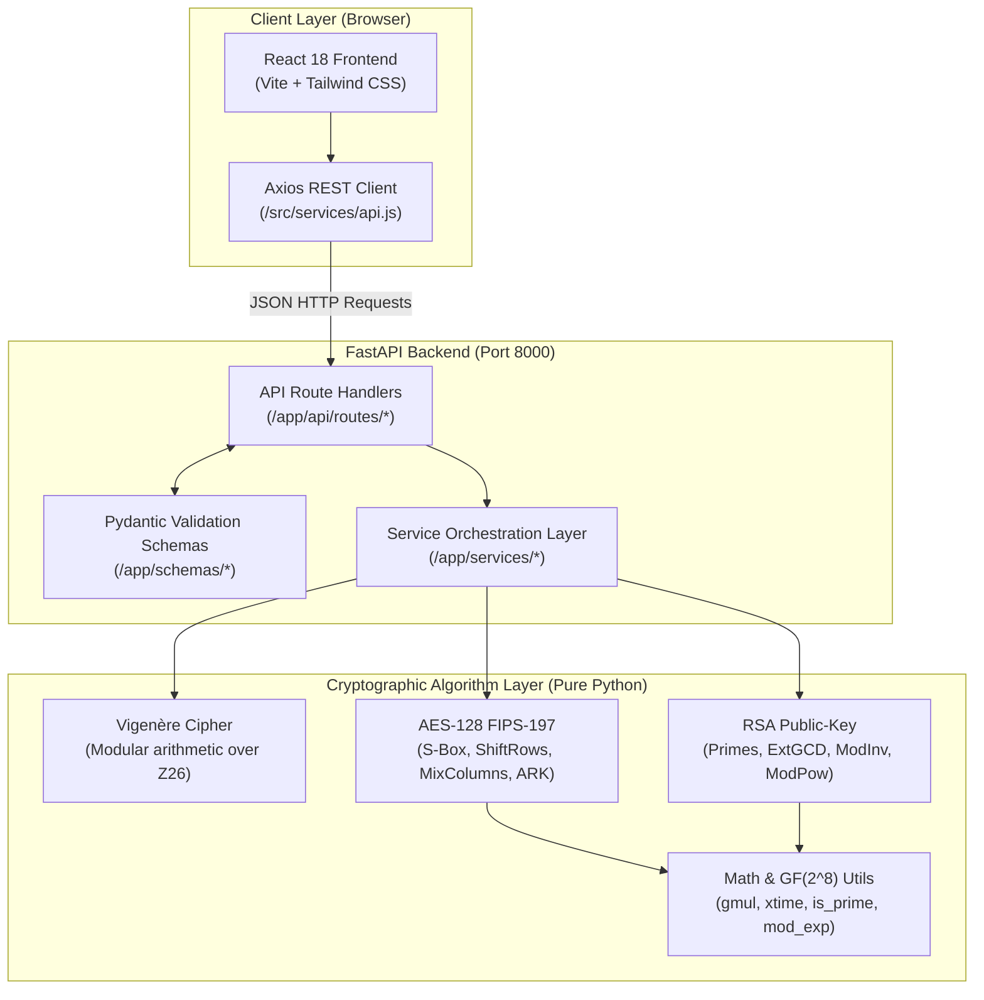

# Cryptography Algorithm Visualizer & Demonstrator

An interactive full-stack academic platform developed for the **Cryptography and Network Security (CNS)** course. This application visualizes the internal operations, intermediate state transitions, and underlying mathematical mechanisms of three foundational cryptographic paradigms:

1. **Vigenère Cipher** — Classical Cryptography (Polyalphabetic substitution over $\mathbb{Z}_{26}$)
2. **AES-128** — Symmetric Cryptography (Advanced Encryption Standard FIPS-197, 128-bit blocks, 10 rounds)
3. **RSA** — Asymmetric Cryptography (Public-key cryptosystem based on integer factorization)

> [!IMPORTANT]
> **Strict Implementation Guarantee**: All cryptographic algorithms and mathematical transformations (modular arithmetic, S-box substitution, Galois Field $\text{GF}(2^8)$ multiplication, Key Expansion, Extended Euclidean Algorithm, and modular exponentiation) are implemented **completely from scratch in pure Python**. No black-box cryptographic libraries (e.g. `cryptography`, `pycryptodome`, or OpenSSL wrappers) are used for encryption or decryption.

---

## 1. Project Objectives
- Bridge the gap between abstract cryptographic mathematics and tangible execution steps.
- Provide step-by-step transparency into classical shifts, symmetric state matrices, and asymmetric modular exponentiation.
- Maintain rigorous separation of concerns between algorithms, service layers, REST APIs, and presentation components.
- Validate cryptographic correctness against standardized test vectors (e.g., official NIST FIPS-197 KAT).

---

## 2. Technology Stack

### Frontend
- **Framework**: React 18 (Vite build tool)
- **Routing**: React Router DOM v6
- **Styling**: Tailwind CSS with custom glassmorphism and monospace typography
- **HTTP Client**: Axios
- **Icons**: Lucide React

### Backend
- **Language**: Python 3.13
- **Framework**: FastAPI
- **Data Validation & Schemas**: Pydantic v2
- **ASGI Server**: Uvicorn

### Testing & Verification
- **Test Runner**: Pytest 9.x
- **Integration Client**: HTTPX / Starlette TestClient

---

## 3. Core Architecture

The architecture adheres to a strict separation of concerns, ensuring that cryptographic algorithms remain pure Python modules independent of web frameworks:



---

## 4. Project Structure

```text
CNS-Cryptography-Lab/
│
├── frontend/
│   ├── src/
│   │   ├── components/
│   │   │   ├── Navbar.jsx              # Navigation header, health status, disclaimer
│   │   │   ├── AlgorithmCard.jsx       # Taxonomy overview cards
│   │   │   ├── InputPanel.jsx          # Inputs with counters & presets
│   │   │   ├── OutputPanel.jsx         # Monospace output with copy-to-clipboard
│   │   │   ├── StepViewer.jsx          # Tabular character-by-character trace
│   │   │   └── StateMatrix.jsx         # 4×4 AES state matrix with byte inspection
│   │   │
│   │   ├── pages/
│   │   │   ├── Home.jsx                # Overview & taxonomy comparison table
│   │   │   ├── Vigenere.jsx            # Vigenère encrypt/decrypt & calculations
│   │   │   ├── AES.jsx                 # AES 128-bit hex visualizer & round stepper
│   │   │   └── RSA.jsx                 # RSA interactive keygen & math traces
│   │   │
│   │   ├── services/
│   │   │   └── api.js                  # Axios client communicating with backend
│   │   │
│   │   ├── utils/
│   │   │   └── formatters.js           # Hex formatting & validation helpers
│   │   │
│   │   ├── App.jsx                     # Layout, routes, footer
│   │   ├── main.jsx                    # React root entrypoint
│   │   └── index.css                   # Tailwind styles & theme variables
│   │
│   ├── package.json
│   ├── tailwind.config.js
│   ├── postcss.config.js
│   └── vite.config.js
│
├── backend/
│   ├── app/
│   │   ├── main.py                     # FastAPI app, CORS, error handling
│   │   │
│   │   ├── api/
│   │   │   └── routes/
│   │   │       ├── vigenere.py         # /api/v1/vigenere/* endpoints
│   │   │       ├── aes.py              # /api/v1/aes/* endpoints
│   │   │       └── rsa.py              # /api/v1/rsa/* endpoints
│   │   │
│   │   ├── services/
│   │   │   ├── vigenere_service.py     # Vigenère business logic & formatting
│   │   │   ├── aes_service.py          # AES round trace packaging
│   │   │   └── rsa_service.py          # RSA keygen & step packaging
│   │   │
│   │   ├── algorithms/
│   │   │   ├── classical/
│   │   │   │   └── vigenere.py         # Pure Vigenère implementation
│   │   │   │
│   │   │   ├── symmetric/
│   │   │   │   └── aes.py              # Pure AES-128 FIPS-197 implementation
│   │   │   │
│   │   │   └── asymmetric/
│   │   │       └── rsa.py              # Pure RSA implementation
│   │   │
│   │   ├── schemas/
│   │   │   ├── vigenere.py             # Pydantic schemas for Vigenère
│   │   │   ├── aes.py                  # Pydantic schemas for AES
│   │   │   └── rsa.py                  # Pydantic schemas for RSA
│   │   │
│   │   └── utils/
│   │       ├── encoding.py             # Hex, byte, and matrix conversions
│   │       └── math_utils.py           # Number theory & Galois Field GF(2^8)
│   │
│   ├── tests/
│   │   ├── test_vigenere.py            # Vigenère unit & roundtrip tests
│   │   ├── test_aes.py                 # AES NIST KAT vector & transformation tests
│   │   ├── test_rsa.py                 # RSA math & crypto tests
│   │   └── test_api_routes.py          # REST API endpoint tests
│   │
│   ├── pytest.ini                      # Pytest configuration
│   ├── requirements.txt                # Python backend dependencies
│   └── README.md                       # Backend specific documentation
│
├── IMPLEMENTATION_PLAN.md              # Detailed implementation strategy
├── TASKS.md                            # Comprehensive task completion checklist
├── README.md                           # Master project documentation
└── .gitignore                          # Repository ignores
```

---

## 5. Cryptographic Theory & Mathematical Foundations

### 5.1. Vigenère Cipher (Classical Cryptography)
The Vigenère cipher is a polyalphabetic substitution cipher based on the Latin alphabet ($A=0, B=1, \dots, Z=25$). A secret keyword is cyclically repeated across the message length.

#### Mathematical Formulas:
- **Encryption**:
  $$C_i = (P_i + K_i) \bmod 26$$
- **Decryption**:
  $$P_i = (C_i - K_i + 26) \bmod 26$$
where $P_i$ is the $i$-th plaintext letter value, $C_i$ is the ciphertext letter value, and $K_i$ is the repeating keyword letter value.

---

### 5.2. AES-128 (Symmetric Cryptography — FIPS-197)
The Advanced Encryption Standard (AES) operates on fixed 128-bit blocks (16 bytes) organized as a $4 \times 4$ byte state matrix in **column-major order**:
$$\text{state}[r][c] = \text{block}[r + 4c]$$

AES-128 uses a 128-bit key and executes 10 rounds:
1. **Key Expansion**: Expands 16-byte key into 11 round keys (44 words of 4 bytes) using `RotWord`, `SubWord`, and round constants `Rcon`.
2. **Round 0 (Initial)**: `AddRoundKey`
3. **Rounds 1 to 9 (Standard)**:
   - `SubBytes`: Non-linear byte substitution using the 256-byte S-box (constructed from multiplicative inverse in $\text{GF}(2^8)$ and affine mapping).
   - `ShiftRows`: Circular left shifts of matrix rows: row 0 by 0, row 1 by 1, row 2 by 2, row 3 by 3.
   - `MixColumns`: Matrix multiplication over Galois Field $\text{GF}(2^8)$ modulo irreducible polynomial $m(x) = x^8 + x^4 + x^3 + x + 1$ ($0\text{x}11\text{B}$):
     $$\begin{bmatrix} s'_{0,c} \\ s'_{1,c} \\ s'_{2,c} \\ s'_{3,c} \end{bmatrix} = \begin{bmatrix} 02 & 03 & 01 & 01 \\ 01 & 02 & 03 & 01 \\ 01 & 01 & 02 & 03 \\ 03 & 01 & 01 & 02 \end{bmatrix} \begin{bmatrix} s_{0,c} \\ s_{1,c} \\ s_{2,c} \\ s_{3,c} \end{bmatrix}$$
   - `AddRoundKey`: Bitwise XOR of the state with the round key.
4. **Round 10 (Final)**: `SubBytes` $\to$ `ShiftRows` $\to$ `AddRoundKey` (`MixColumns` omitted).

**Decryption** executes the exact inverse transformations (`InvShiftRows`, `InvSubBytes`, `InvMixColumns`, `AddRoundKey`) with round keys applied in reverse order.

---

### 5.3. RSA (Asymmetric Cryptography)
RSA is an asymmetric public-key cryptosystem based on the computational intractability of factoring large composite semiprimes.

#### Mathematical Process:
1. **Primes Selection**: Select two distinct primes $p$ and $q$.
2. **Modulus Calculation**:
   $$n = p \times q$$
3. **Euler's Totient Function**:
   $$\phi(n) = (p - 1)(q - 1)$$
4. **Public Exponent**: Choose integer $e$ such that $1 < e < \phi(n)$ and $\gcd(e, \phi(n)) = 1$.
5. **Private Exponent**: Compute $d$ using the Extended Euclidean Algorithm:
   $$e \cdot d \equiv 1 \pmod{\phi(n)} \iff d \equiv e^{-1} \pmod{\phi(n)}$$
6. **Public Key**: $(e, n)$
7. **Private Key**: $(d, n)$
8. **Encryption**: For message block $M < n$:
   $$C = M^e \bmod n$$
9. **Decryption**:
   $$M = C^d \bmod n$$

Intermediate exponentiations are calculated using the **Binary Square-and-Multiply** method to prevent integer overflow and track binary bit iterations.

---

## 6. Official AES-128 Known-Answer Test Vector

The AES implementation passes the official NIST FIPS-197 Known-Answer Test (KAT) vector:

| Parameter | Value (Hexadecimal) |
|---|---|
| **Key** | `000102030405060708090a0b0c0d0e0f` |
| **Plaintext Block** | `00112233445566778899aabbccddeeff` |
| **Expected Ciphertext** | `69c4e0d86a7b0430d8cdb78070b4c55a` |
| **Decrypted Output** | `00112233445566778899aabbccddeeff` |

Verified in automated unit test `backend/tests/test_aes.py::test_aes_nist_known_answer_vector_encryption`.

---

## 7. REST API Documentation

### Base URL: `http://localhost:8000/api/v1`

### 7.1. Health Check
- **`GET /health`**
- **Response**:
  ```json
  {
    "status": "ok",
    "app": "Cryptography Algorithm Visualizer & Demonstrator",
    "version": "1.0.0",
    "algorithms": ["vigenere", "aes-128", "rsa"]
  }
  ```

### 7.2. Vigenère Cipher Endpoints
- **`POST /vigenere/encrypt`**
  - **Body**: `{"plaintext": "HELLO CNS LAB", "key": "CIPHER"}`
  - **Response**: `{"mode": "encrypt", "result": "...", "steps": [...]}`
- **`POST /vigenere/decrypt`**
  - **Body**: `{"ciphertext": "...", "key": "CIPHER"}`
  - **Response**: `{"mode": "decrypt", "result": "...", "steps": [...]}`

### 7.3. AES-128 Endpoints
- **`POST /aes/encrypt`**
  - **Body**:
    ```json
    {
      "plaintext_hex": "00112233445566778899aabbccddeeff",
      "key_hex": "000102030405060708090a0b0c0d0e0f"
    }
    ```
  - **Response**: Returns 11 round traces with 4×4 hexadecimal state matrices for every transformation (`SubBytes`, `ShiftRows`, `MixColumns`, `AddRoundKey`) and the 11-key schedule.
- **`POST /aes/decrypt`**
  - **Body**:
    ```json
    {
      "ciphertext_hex": "69c4e0d86a7b0430d8cdb78070b4c55a",
      "key_hex": "000102030405060708090a0b0c0d0e0f"
    }
    ```

### 7.4. RSA Endpoints
- **`POST /rsa/generate-keys`**
  - **Body**: `{"p": 61, "q": 53, "e": 17}`
  - **Response**:
    ```json
    {
      "p": 61,
      "q": 53,
      "n": 3233,
      "phi_n": 3120,
      "e": 17,
      "d": 2753,
      "public_key": {"e": 17, "n": 3233},
      "private_key": {"d": 2753, "n": 3233},
      "candidate_exponents": [17, 3, 5, 7, 11],
      "derivation_steps": [...]
    }
    ```
- **`POST /rsa/encrypt`**
  - **Body**: `{"message": "65", "message_type": "number", "e": 17, "n": 3233}`
  - **Response**: `{"ciphertext": "2790", "blocks": [...]}`
- **`POST /rsa/decrypt`**
  - **Body**: `{"ciphertext": "2790", "message_type": "number", "d": 2753, "n": 3233}`
  - **Response**: `{"decrypted_message": "65", "blocks": [...]}`

---

## 8. Installation & Setup Guide

### Prerequisites
- **Python**: Version 3.10 or higher
- **Node.js**: Version 18.0 or higher
- **npm**: Version 9.0 or higher

---

### 8.1. Backend Setup

```bash
# 1. Open a terminal and enter the backend directory
cd backend

# 2. Create Python virtual environment
python -m venv .venv

# 3. Activate the virtual environment
# On Windows (PowerShell):
.\.venv\Scripts\Activate.ps1
# On Linux/macOS:
source .venv/bin/activate

# 4. Install backend dependencies
pip install -r requirements.txt

# 5. Start the FastAPI backend server
uvicorn app.main:app --reload --port 8000
```
Backend will be live at `http://localhost:8000`. Interactive documentation at `http://localhost:8000/docs`.

---

### 8.2. Frontend Setup

```bash
# 1. Open a separate terminal and navigate to the frontend directory
cd frontend

# 2. Install dependencies
npm install

# 3. Start Vite development server
npm run dev
```
Frontend will be accessible at `http://localhost:5173`.

---

## 9. Running Tests

Run the complete backend test suite to verify cryptographic correctness:

```bash
cd backend
.\.venv\Scripts\pytest
```

Output:
```text
============================= test session starts =============================
platform win32 -- Python 3.13.0, pytest-9.1.1, pluggy-1.6.0
collected 27 items

tests\test_aes.py .........                                              [ 33%]
tests\test_api_routes.py ....                                            [ 48%]
tests\test_rsa.py .......                                                [ 74%]
tests\test_vigenere.py .......                                           [100%]

============================== 27 passed in 0.97s =============================
```

To run individual test suites:
- `pytest tests/test_vigenere.py`
- `pytest tests/test_aes.py`
- `pytest tests/test_rsa.py`
- `pytest tests/test_api_routes.py`

---

## 10. Limitations & Future Enhancements

### Limitations
- **Academic Parameter Scale**: RSA is intentionally demonstrated using small educational primes ($p, q < 1000$) to enable human-readable mathematical tracking. Real-world RSA requires 2048-bit or 4096-bit primes.
- **Single Block AES**: AES-128 is demonstrated on a single 128-bit block (Electronic Codebook / primitive block transformation) to clearly visualize the $4 \times 4$ state matrix without padding or chaining complexities.
- **Classical Cipher Insecurity**: Vigenère cipher is vulnerable to Kasiski examination and index of coincidence analysis and is included strictly for pedagogical history.

### Future Enhancements
- Visual Kasiski examination tool for cracking Vigenère ciphers.
- Block cipher modes of operation visualizer (CBC, CTR, GCM) with Initialization Vector (IV) propagation.
- Elliptic Curve Cryptography (ECC) point addition and doubling demonstrator.
- Diffie-Hellman Key Exchange interactive protocol diagram.

---

## 11. Academic Disclaimer

> [!CAUTION]
> **This application is an educational implementation designed to demonstrate the internal operation of cryptographic algorithms for a Cryptography and Network Security (CNS) assignment.**
>
> It is **not** intended for production-grade cryptographic security. In real-world secure applications, use vetted and audited security standards and implementations (such as AES-GCM and RSA-OAEP with large keys or modern post-quantum cryptography).
